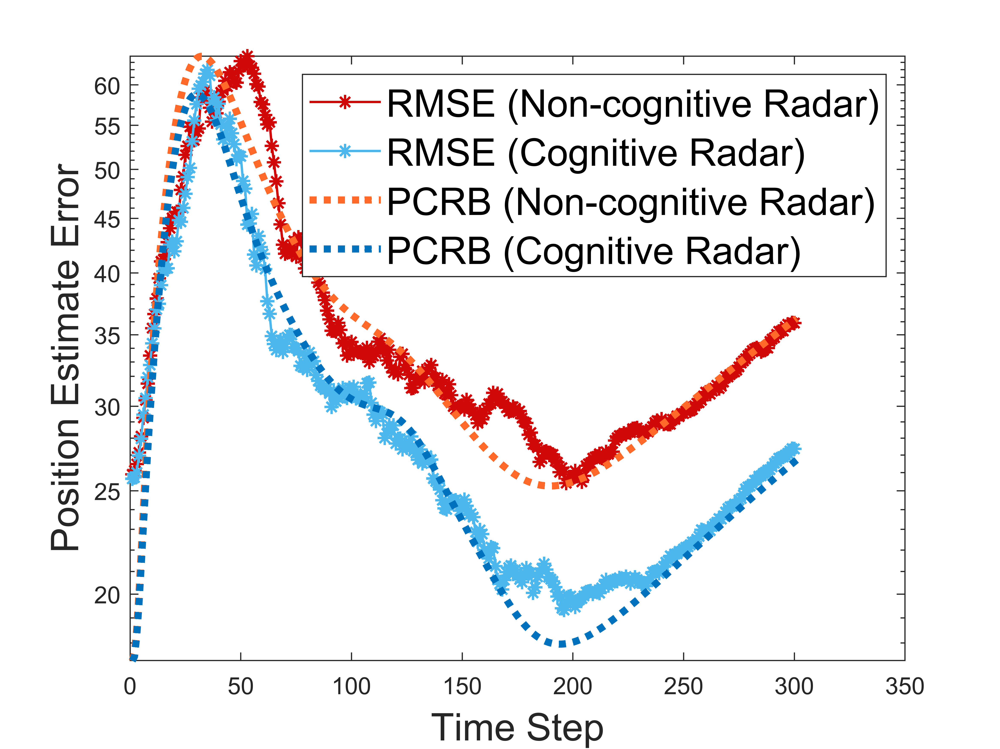
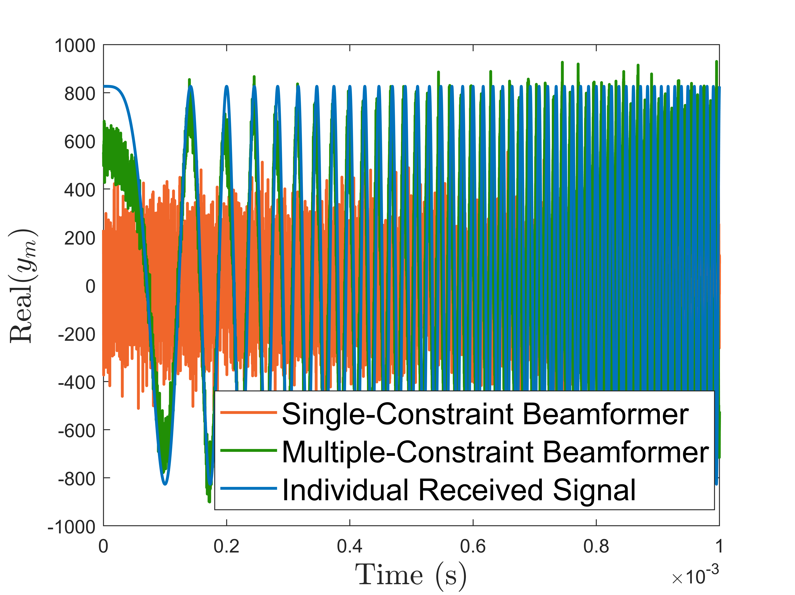
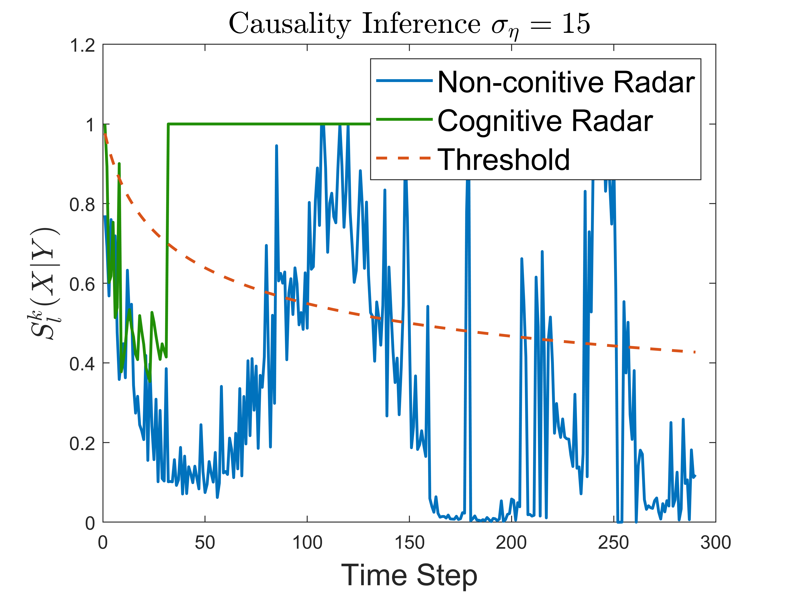

# Cognitive Radar Identification
**Project FREEDOM 2.2.1: Cognitive Radar Identification**

This repository contains MATLAB scripts and functions to implement and analyze cognitive radar environments, focusing on optimal power allocation strategies and target trajectory tracking.

## Files and Scripts

### 1. `radarConfig.m`
- **Description**: Sets and configures the radar and waveform parameters.

### 2. `radarScenario_range_based.m`
- **Description**: The most basic script for range-based radar tracking.

### 3. `radarScenario_range_based_policies_performance_fix_path.m`
- **Description**: 
  - Implements the cognitive radar environment.
  - The cognitive behavior focuses on an optimal power allocation strategy.
  - The trajectory of the target is fixed.
  - This figure shows the tracking performance of cognitive/non-cognitive radars.
    

### 4. `radarScenario_range_based_policies_performance_rand_path.m`
- **Description**: 
  - Implements the cognitive radar environment.
  - The trajectory of the target is randomly generated.

### 5. `radarScenario_range_based_data_collection_pos_error.m`
- **Description**: 
  - Implements beamforming and collects data (power estimation and distance).
  - The data is generated based on different uncertainties of the radar position.
  - This figure shows the beamformer performance.
  - 

### 6. `radarScenario_range_based_data_analysis_one_error_pos.m`
- **Description**: 
  - Analyzes one realization using:
    1. Mutual Information and AD-test.
    2. Causality inference.
  - This script is used to make decisions regarding cognitive/non-cognitive radar.
  - This figure shows the mutual information + AD-test and causality inference under uncertainty of radar position.
  
  

### 7. `radarScenario_range_based_data_analysis_all_error_pos.m`
- **Description**: 
  - Analyzes all Monte Carlo experiments using:
    1. Mutual Information and AD-test.
    2. Causality inference.
  - Provides the probability of Type-I and Type-II errors in cognitive radar decisions.

## Requirements

All scripts can be run on MATLAB (version 2023a or later). Additionally, you may need to install the following extra packages:

- **Statistics and Machine Learning Toolbox** (for KDE method)
- **Optimization Toolbox** (for power optimization)
- **Parallel Computing Toolbox** (for faster processing when collecting data and computing mutual information)

## How to Run

1. Clone this repository to your local machine.
2. Open MATLAB and navigate to the directory where the repository is cloned.
3. Ensure that all required toolboxes are installed.
4. Run the desired script as per your requirement.

## Contact

For any questions or inquiries, please contact Shuo[tang.shu@northeastern.edu].
